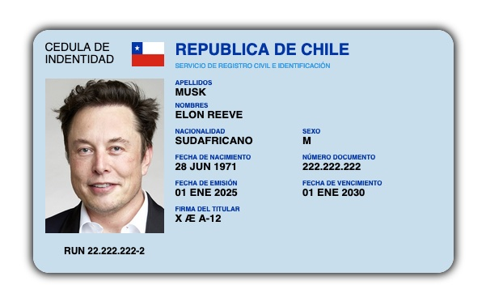

# Desafío: Introducción a Componentes Web y Vue.js

Este proyecto forma parte de un desafío donde se pone a prueba el conocimiento de interpolación de variables en plantillas utilizando Vue.js. El objetivo es crear una aplicación con Vite, siguiendo las mejores prácticas para el desarrollo de componentes en Vue.js.

## Descripción del Proyecto

En este desafío, desarrollamos una aplicación sencilla que utiliza Vue.js para gestionar el estado local y realizar interpolaciones de variables dentro del componente `App`. El proyecto incluye un carnet predefinido en HTML y CSS que será integrado en la aplicación.

## Objetivos

- Practicar la interpolación de variables con Vue.js.
- Configurar un proyecto desde cero utilizando Vite.
- Implementar buenas prácticas en la estructura y organización del código.

## Estructura del Proyecto

- **Vue.js** para la gestión de componentes y la interpolación de variables.
- **Vite** como herramienta de desarrollo para la construcción y despliegue rápido de la aplicación.
- **HTML y CSS** proporcionados como base para el carnet visual de la aplicación.

## Tecnologías Utilizadas

- Vue.js
- Vite
- HTML5
- CSS3
