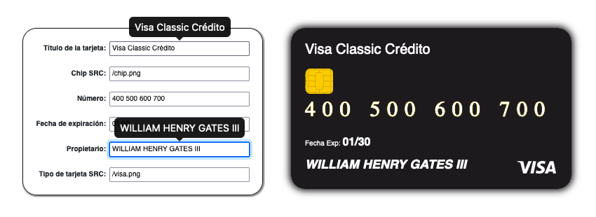

# Desafío - Binding de Formularios (I)

En este desafío se pondrán a prueba los conocimientos sobre **data binding** en Vue.js utilizando directivas. El objetivo es crear una aplicación que permita el llenado dinámico de un formulario para los datos de una tarjeta de crédito.

## Descripción del Desafío

Se deberá crear una aplicación en **Vue.js** que permita:
- Generar un formulario interactivo que actualice en tiempo real los datos de una tarjeta de crédito.
- Implementar **data binding** para que los cambios en los inputs se reflejen directamente en la vista de la tarjeta.
- adicionalmente se modularizo el código de CSS y se agregaron tooltip para facilitar el llenado de los campos.

Este desafío es ideal para reforzar las habilidades en Vue.js y profundizar en el manejo de formularios dinámicos.

### Resultado final

