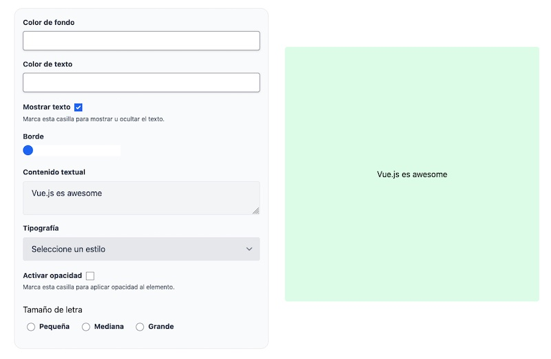
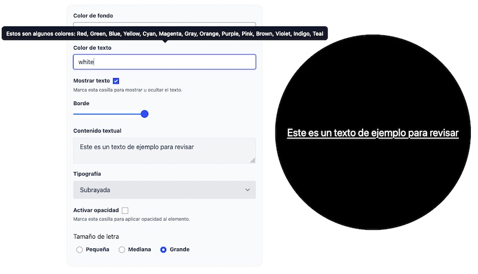

# Desafío - Templates y rendering en Vue

## Características de este desafío: 

- Se utilizó style binding para asignar estilos reactivamente a un elemento usando valores del estado.

- Se aplicó class binding para asignar clases reactivamente a un elemento usando valores booleanos de estado.

- Se empleó v-for para iterar sobre los arreglos del estado en el template, permitiendo la renderización dinámica de los elementos.

- Se implementó v-show para mostrar u ocultar el objeto.

- Se utilizaron además las siguientes directivas:
    - :style={}
    - :class={}
    - v-for
    - v-model

- El diseño del formulario fue desarrollado utilizando el framework Tailwind CSS, mientras que los tooltips se implementaron con Flowbite.

## Resultado final: 

