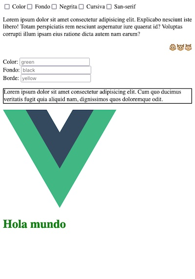
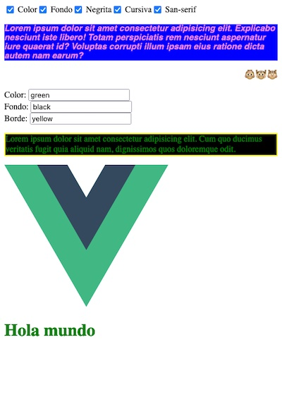

# Templates y rendering en Vue
## Estilos condicionales

- Binding de estilos.
    - :style="{ }"
    - :class="{ }"

|Estado inicial| Resultado final|
|--------------|----------------|
| | |  
         