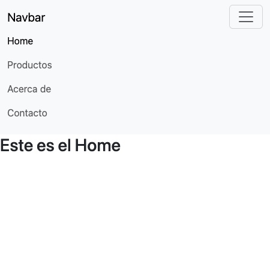
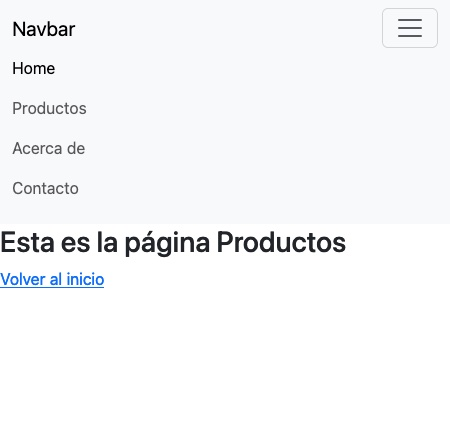
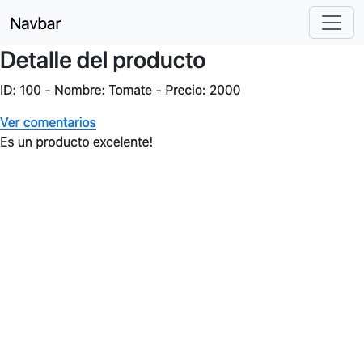
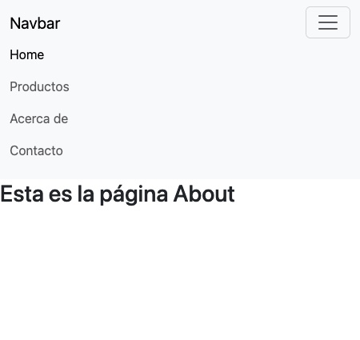
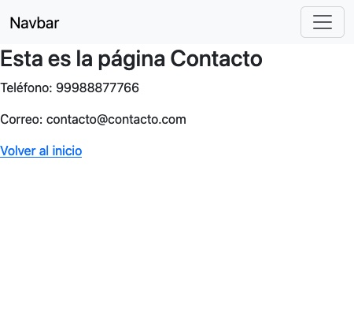

# Guía de ejercicios - Vue Router (II)
## Manejo de rutas

### Rutas estáticas

Las rutas estáticas son representaciones de los componentes de Vue que queremos presentarle al usuario. Recordemos que estas se definen a través de objetos JSON indicando en la propiedad path la dirección.

### Rutas dinámicas

- Las rutas dinámicas permiten mostrar contenido en función de las circunstancias que se estén demandando.

- Estas circunstancias están determinadas por las acciones que realizan los/as visitantes del sitio, por ejemplo, al dar clic en un botón o un enlace.

### Redirecciones con el router

- Las redirecciones son comunes en los sitios web.
- Se utilizan para redirigir al visitante a partir de una acción
determinada.
- Supongamos que tenemos un botón que al dar click sobre
él, lleva al visitante a la página de inicio.

#### Resultado final.

|  |  |
| ----------------------------------- | ------------------------------------------- |
|  |  |
|  |                                          |
