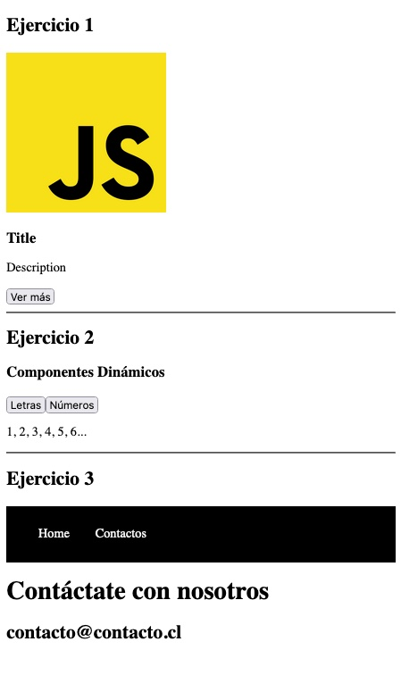

# Manejo de eventos y reutilización de componentes

## Comunicación entre componentes

### Emitir eventos a componente padre

#### $emit (Revisar carpeta instrumentos-musicales)

- En cada uno de nuestros componentes disponemos de una gran biblioteca de métodos y atributos que Vue nos provee para realizar diferentes tareas.

- el $emit nos ayudará a emitirle a un componente padre la notificación de que necesitamos que haga algo o que reciba algo.

### Distribución de contenido en Slots

#### slot

- Es posible que necesitemos que parte de un componente sea completamente dinámico debido a que no tengamos la certeza de qué es lo que deba ir ahí.

- Para estos casos donde el contenido es desconocido, podemos ocupar los slots.

### Componentes dinámicos

- En algunos casos la incertidumbre de una aplicación y su contenido puede escalar a no solo una parte de un componente sinó de qué componente debemos renderizar.

- Para este escenario en Vue contamos con los componentes dinámicos que nos permite definir con una variable del estado cuál componente se renderiza en un lugar en específico.

## Resultado de los ejercicios:

